# OIDC Bridge

This is an **OAuth 2.0 to OpenID Connect conversion service** that acts as a non-intrusive adapter layer, converting existing OAuth 2.0 identity providers into fully OpenID Connect compliant services without requiring any modifications to the original OP.

**Language: English/[中文](README_cn.md)**

## Features

- **Discovery endpoint** (/.well-known/openid-configuration) - Standard OIDC discovery configuration
- **Authorization endpoint** (/authorize) - Scope mapping and nonce handling
- **Token endpoint** (/token) - ID Token generation using OP's UserInfo
- **UserInfo endpoint** (/userinfo) - Attribute mapping and standardization
- **JWKS endpoint** (/.well-known/jwks.json) - Public keys for ID Token verification

## How It Works

This service acts as a transparent proxy between Relying Parties (RPs) and OAuth 2.0 Identity Providers (OPs), providing full OIDC compatibility while:
- **Preserving existing RP credentials** - No need to re-register clients
- **Maintaining OP compatibility** - Works with any standard OAuth 2.0 OP
- **Zero code changes** - Simply replace the OP endpoint with the bridge service
- **No credential storage** - Never stores client secrets or sensitive data

**Request/Response Flow:**

```mermaid
sequenceDiagram
    participant RP as Relying Party
    participant Proxy as Conversion Service
    participant OP as OAuth2 Provider

    RP->>Proxy: 1. GET /authorize<br/>client_id=rp-abc, scope=openid profile
    Proxy->>Proxy: 2. ✅ Scope mapping: openid→(remove), profile→basic
    Proxy->>Proxy: 3. 💾 Cache nonce (key=rp-abc|https://rp.com/callback)
    Proxy->>OP: 4. Redirect to /authorize<br/>client_id=rp-abc, scope=basic
    OP->>RP: 5. OP login page (shows RP app name)
    RP->>OP: 6. User consents
    OP->>RP: 7. 🔑 Redirect to https://rp.com/callback?code=auth_code
    RP->>Proxy: 8. POST /token<br/>code=auth_code, client_id=rp-abc
    Proxy->>OP: 9. POST /token (forward RP credentials)
    OP->>Proxy: 10. Return access_token
    Proxy->>OP: 11. GET /userinfo (with access_token)
    OP->>Proxy: 12. Return user claims
    Proxy->>Proxy: 13. ✅ Generate ID Token (aud=rp-abc)
    Proxy->>RP: 14. Return id_token + access_token
```



## Configuration

The configuration file is `config.yaml`, which includes the following configuration items based on your OAuth 2.0 provider:

| Configuration Item | Required | Description | Example |
|-------------------|----------|-------------|---------|
| `op_authorize_url` | Yes | Your OP's OAuth2 authorization endpoint | `https://op.example.com/oauth/authorize` |
| `op_token_url` | Yes | Your OP's OAuth2 token endpoint | `https://op.example.com/oauth/token` |
| `op_userinfo_url` | Yes | Your OP's userinfo endpoint | `https://op.example.com/oauth/userinfo` |
| `issuer` | No | The issuer identifier for this bridge service. If not provided, it will be automatically obtained from the request URL | `https://your-bridge.example.com` |
| `id_token_lifetime` | Yes | ID Token lifetime in seconds | `3600` |
| `nonce_cache_ttl` | Yes | Nonce cache TTL in seconds (≤ 300s recommended) | `300` |
| `id_token_signing_alg` | Yes | ID Token signing algorithm | `RS256` |
| `scope_mapping` | Yes | Map OIDC scopes to your OP's OAuth2 scopes | `{"openid":"profile email", "profile":"basic", "email":"email"}` |
| `user_attribute_mapping` | Yes | Map OP user attributes to OIDC claims | `{"username":"sub", "email":"email", "name":"name"}` |
| `redis_addr` | No | Redis address for nonce cache (optional) | `localhost:6379` |
| `private_key_path` | Yes | Path to RSA private key for ID Token signing | `/path/to/private.key` |
| `public_key_path` | Yes | Path to RSA public key for JWKS endpoint | `/path/to/public.key` |

## Deployment

### Prerequisites

Before deploying the service, you need to clone the repo and generate RSA key pairs for signing ID tokens:

```bash
# Clone the repository
cd /opt
git clone https://github.com/Visecy/oidc-bridge.git
cd oidc-bridge

# Generate a private key
make keygen
```

### Configuration File Guide

Create a `config.yaml` file with the following content:

```yaml
# OP endpoints
op_authorize_url: "https://your-op.com/oauth/authorize"
op_token_url: "https://your-op.com/oauth/token"
op_userinfo_url: "https://your-op.com/oauth/userinfo"

# Issuer identifier
issuer: "https://your-oidc-bridge.com"

# ID Token settings
id_token_lifetime: 3600  # 1 hour
nonce_cache_ttl: 600    # 10 minutes
id_token_signing_alg: "RS256"

# Scope mapping
scope_mapping:
  openid: "profile email"
  profile: "name picture"
  email: "email"

# User attribute mapping
user_attribute_mapping:
  sub: "user_id"
  name: "full_name"
  email: "email_address"
  picture: "avatar_url"
  # For nested attributes, use '::' as key delimiter (commented out as example)
  # data::email: "email"
  # data::name: "name"
  # data::avatar_url: "picture"

# Redis address (optional)
# redis_addr: "localhost:6379"

# Key paths
private_key_path: "/path/to/private.key"
public_key_path: "/path/to/public.key"
```

### Local Deployment

1. Install Go 1.22 or higher
2. Run `go mod tidy` to install dependencies
3. Run `make build` to compile the project
4. Run `./output/oidc-bridge` to start the service

You can specify a custom configuration file, key paths, and port using command line arguments or environment variables:

```bash
# Using command line arguments
./output/oidc-bridge --config=/opt/oidc-bridge/config.yaml --private-key=/opt/oidc-bridge/private.key --public-key=/opt/oidc-bridge/public.key --port=8080

# Using environment variables
CONFIG_FILE=/opt/oidc-bridge/conf/config.yaml PRIVATE_KEY_PATH=/opt/oidc-bridge/conf/private.key PUBLIC_KEY_PATH=/opt/oidc-bridge/conf/public.key ./output/oidc-bridge
```

### Docker Deployment

1. Build the image: `docker build -t oidc-bridge .`
2. Run the container: `docker run -p 8080:8080 -v /opt/oidc-bridge/conf:/root/conf oidc-bridge --config=/root/conf/config.yaml --private-key=/root/conf/private.key --public-key=/root/conf/public.key`

### Docker Compose Deployment

Create a `docker-compose.yml` file with the following content:

```yaml
version: '3.8'

services:
  oidc-bridge:
    build: .
    ports:
      - "8080:8080"
    volumes:
      - ./conf:/root/conf
    environment:
      - REDIS_ADDR=redis:6379
      - CONFIG_FILE=/root/conf/config.yaml
      - PRIVATE_KEY_PATH=/root/conf/private.key
      - PUBLIC_KEY_PATH=/root/conf/public.key
      - GIN_MOD=release
    depends_on:
      - redis

  redis:
    image: redis:alpine
    ports:
      - "6379:6379"
```

Then run the services using:

```bash
docker-compose up -d
```

## Testing

### Basic Testing

You can perform basic testing with the following commands:

```bash
# Get Discovery document
curl http://localhost:8080/.well-known/openid-configuration

# Get JWKS
curl http://localhost:8080/.well-known/jwks.json
```

### Unit Testing

The project includes a comprehensive unit test suite covering all major modules.

Run all tests:

```bash
make test
```

Note: Some tests may require Redis service running at localhost:6379 and valid key files.


## ⚠️ Security Warning

**IMPORTANT: Do NOT use oidc-bridge servers built by untrusted parties!**

Oidc-bridge does not bind to specific client_ids and supports shared usage by multiple RPs in principle. But using oidc-bridge services provided by untrusted parties poses serious security risks:

- **permission leakage risk**: During the authorization process, oidc-bridge can obtain the RP's client_secret and effectively has the same access permissions as the RP
- **data leakage risk**: oidc-bridge can access all user data and access tokens that pass through it

**Recommendations:**
- Always build and deploy your own oidc-bridge service
- Ensure oidc-bridge runs in a trusted environment
- Regularly rotate client_secrets and access tokens
- Monitor oidc-bridge access logs and anomalous behavior