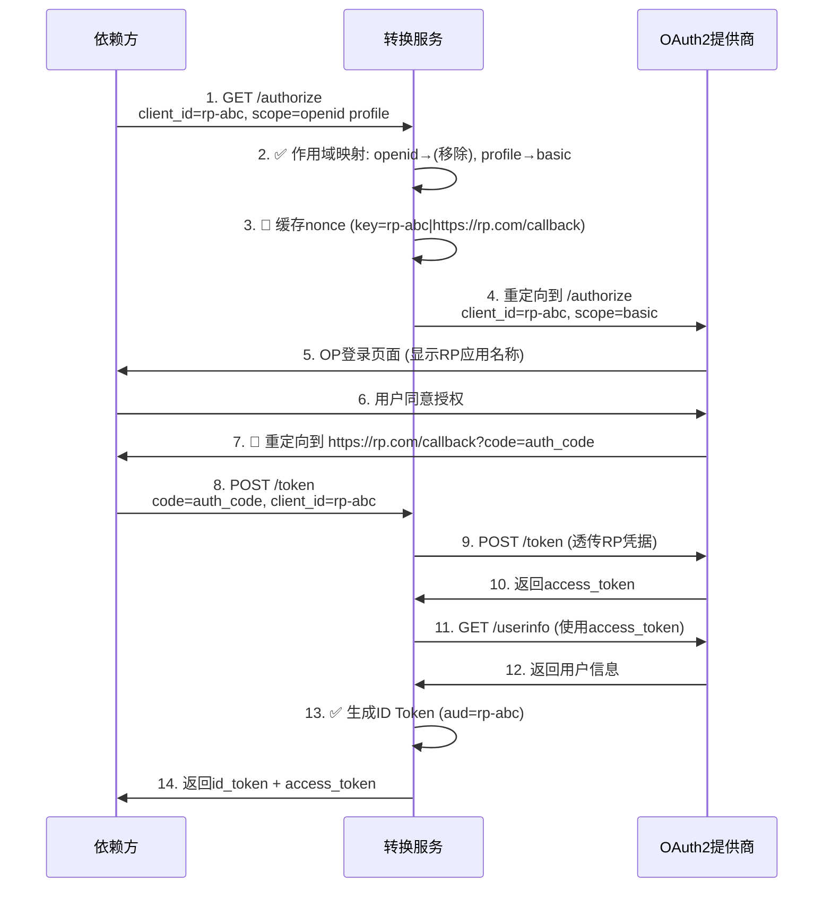

# OIDC Bridge

这是一个**OAuth 2.0 到 OpenID Connect 转换服务**，作为无侵入式适配层，将仅支持 OAuth 2.0 的身份提供者转换为完全符合 OpenID Connect 标准的服务，无需对原始 OP 进行任何修改。

**语言: [English](README.md)/中文**

## 功能

- **Discovery端点** (/.well-known/openid-configuration) - 标准 OIDC 发现配置
- **Authorization端点** (/authorize) - Scope 映射和 nonce 处理
- **Token端点** (/token) - 使用 OP UserInfo 生成 ID Token
- **UserInfo端点** (/userinfo) - 属性映射和标准化
- **JWKS端点** (/.well-known/jwks.json) - ID Token 验证公钥

## 工作原理

该服务作为依赖方(RP)和 OAuth 2.0 身份提供者(OP)之间的透明代理，提供完整的 OIDC 兼容性：
- **保留现有 RP 凭据** - 无需重新注册客户端
- **保持 OP 兼容性** - 适用于任何标准 OAuth 2.0 OP
- **零代码修改** - 只需将 OP 端点替换为桥接服务
- **无凭据存储** - 从不存储客户端密钥或敏感数据

**请求/响应流程：**



## 配置

配置文件为`config.yaml`，需根据您的OAuth 2.0提供者的实际端点和属性结构进行配置：

| 配置项 | 必填 | 说明 | 示例 |
|-------------------|----------|-------------|---------|
| `op_authorize_url` | 是 | 您的OAuth 2.0提供者授权端点 | `https://op.example.com/oauth/authorize` |
| `op_token_url` | 是 | 您的OAuth 2.0提供者Token端点 | `https://op.example.com/oauth/token` |
| `op_userinfo_url` | 是 | 您的OAuth 2.0提供者UserInfo端点 | `https://op.example.com/oauth/userinfo` |
| `issuer` | 否 | 桥接服务的Issuer标识。如果未提供，将从请求的URL中自动获取 | `https://your-bridge.example.com` |
| `id_token_lifetime` | 是 | ID Token生命周期（秒） | `3600` |
| `nonce_cache_ttl` | 是 | nonce缓存TTL（秒，建议≤300秒） | `300` |
| `id_token_signing_alg` | 是 | ID Token签名算法 | `RS256` |
| `scope_mapping` | 是 | 将OIDC scopes映射到OP的OAuth 2.0 scopes | `{"openid":"profile email", "profile":"basic", "email":"email"}` |
| `user_attribute_mapping` | 是 | 将OP用户属性映射到OIDC声明 | `{"username":"sub", "email":"email", "name":"name"}` |
| `redis_addr` | 否 | Redis地址用于nonce缓存（可选） | `localhost:6379` |
| `private_key_path` | 是 | RSA私钥路径用于ID Token签名 | `/path/to/private.key` |
| `public_key_path` | 是 | RSA公钥路径用于JWKS端点 | `/path/to/public.key` |

## 部署

### 准备工作

在部署服务之前，您需要克隆代码仓库并生成用于签名ID Token的RSA密钥对：

```bash
# 克隆代码仓库
cd /opt
git clone https://github.com/Visecy/oidc-bridge.git
cd oidc-bridge

# 生成私钥
make keygen
```

### 配置文件编写指南

根据您的OAuth 2.0提供者创建 `config.yaml` 文件，配置应反映实际的OP端点和属性结构：

```yaml
# 您的OAuth 2.0提供者端点
op_authorize_url: "https://your-op.com/oauth/authorize"
op_token_url: "https://your-op.com/oauth/token"
op_userinfo_url: "https://your-op.com/oauth/userinfo"

# 桥接服务配置
issuer: "https://your-bridge-domain.com"

# 安全设置
id_token_lifetime: 3600      # 1小时
nonce_cache_ttl: 300         # 5分钟（最大推荐值）
id_token_signing_alg: "RS256"

# Scope映射：OIDC scopes → OP OAuth2 scopes
scope_mapping:
  openid: "profile email"    # 将OIDC 'openid'映射到OP scopes
  profile: "basic"           # 将OIDC 'profile'映射到OP 'basic'
  email: "email"             # 将OIDC 'email'映射到OP 'email'

# 属性映射：OP响应字段 → OIDC声明
user_attribute_mapping:
  sub: "user_id"            # 将OP 'user_id'映射到OIDC 'sub'
  name: "full_name"         # 将OP 'full_name'映射到OIDC 'name'
  email: "email_address"    # 将OP 'email_address'映射到OIDC 'email'
  picture: "avatar_url"       # 将OP 'avatar_url'映射到OIDC 'picture'
  
  # 支持使用'::'作为键分隔符的嵌套属性
  # data::email: "email"     # 将嵌套OP字段'data.email'映射到OIDC 'email'
  # data::profile::name: "name"  # 映射深层嵌套字段

# 可选：Redis用于nonce缓存（未提供则使用内存）
# redis_addr: "localhost:6379"

# RSA密钥对用于ID Token签名
private_key_path: "/path/to/private.key"
public_key_path: "/path/to/public.key"
```

### 本地运行

1. 安装Go 1.22或更高版本
2. 运行`go mod tidy`安装依赖
3. 运行`make build`编译项目
4. 运行`./output/oidc-bridge`启动服务

您可以通过命令行参数或环境变量指定自定义配置文件、密钥路径和端口：

```bash
# 使用命令行参数
./output/oidc-bridge --config=/opt/oidc-bridge/config.yaml --private-key=/opt/oidc-bridge/private.key --public-key=/opt/oidc-bridge/public.key --port=8080

# 使用环境变量
CONFIG_FILE=/opt/oidc-bridge/config.yaml PRIVATE_KEY_PATH=/opt/oidc-bridge/private.key PUBLIC_KEY_PATH=/opt/oidc-bridge/public.key ./output/oidc-bridge
```

### Docker部署

1. 构建镜像: `docker build -t oidc-bridge .`
2. 运行容器: `docker run -p 8080:8080 -v /opt/oidc-bridge/conf:/root/conf oidc-bridge --config=/root/conf/config.yaml --private-key=/root/conf/private.key --public-key=/root/conf/public.key`

### Docker Compose部署

创建一个`docker-compose.yml`文件，内容如下：

```yaml
version: '3.8'

services:
  oidc-bridge:
    build: .
    ports:
      - "8080:8080"
    volumes:
      - ./conf:/root/conf
    environment:
      - REDIS_ADDR=redis:6379
      - CONFIG_FILE=/root/conf/config.yaml
      - PRIVATE_KEY_PATH=/root/conf/private.key
      - PUBLIC_KEY_PATH=/root/conf/public.key
      - GIN_MOD=release
    depends_on:
      - redis

  redis:
    image: redis:alpine
    ports:
      - "6379:6379"
```

然后使用以下命令运行服务：

```bash
docker-compose up -d
```

## 测试

### 基本测试

可以使用以下命令进行基本测试：

```bash
# 获取Discovery文档
curl http://localhost:8080/.well-known/openid-configuration

# 获取JWKS
curl http://localhost:8080/.well-known/jwks.json
```

### 单元测试

项目包含全面的单元测试套件，覆盖了所有主要模块。

运行所有测试：

```bash
make test
```

注意：某些测试可能需要Redis服务运行在localhost:6379，并且需要有效的密钥文件。

## ⚠️ 安全警告

**重要：请勿使用非可信方构建的oidc-bridge服务器！**

虽然oidc-bridge不绑定特定的client_id，原理上支持多个RP共享使用，但使用非可信方提供的oidc-bridge服务存在严重的安全风险：

- **权限泄露风险**：在授权过程中，oidc-bridge能够获取RP的client_secret，实际上与RP拥有相同的访问权限
- **数据泄露风险**：oidc-bridge可以访问所有经过它的用户数据和访问令牌

**建议：**
- 始终自行构建和部署oidc-bridge服务
- 确保oidc-bridge运行在受信任的环境中
- 定期轮换client_secret和访问令牌
- 监控oidc-bridge的访问日志和异常行为